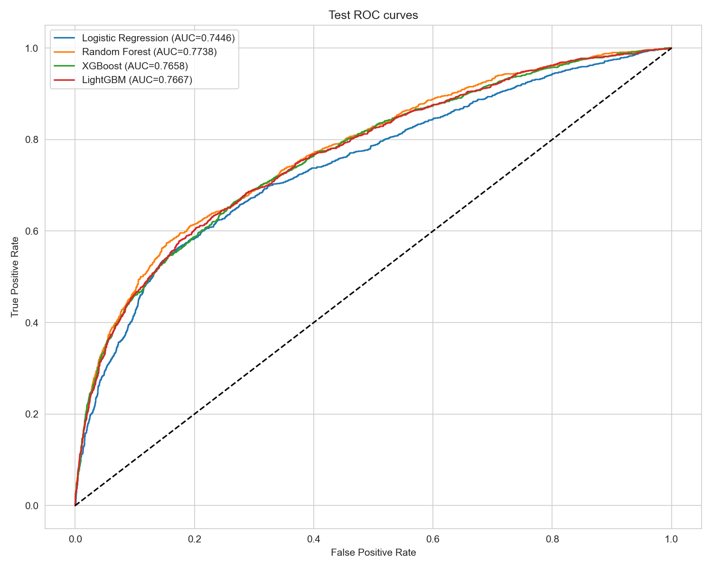
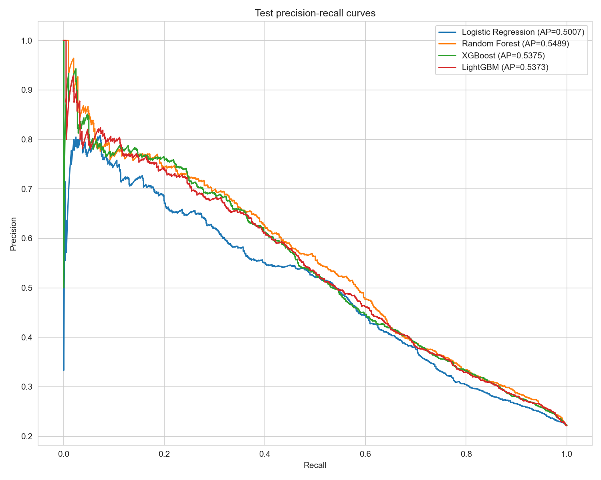
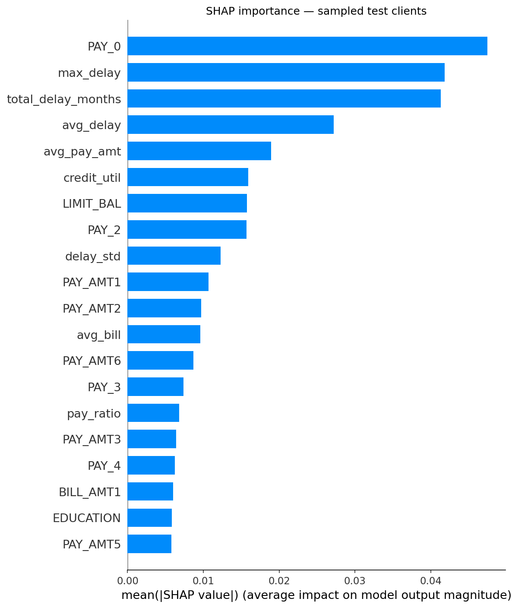

<div align="center">

# Credit Risk Prediction

**Credit card default prediction with fold-safe validation and interpretable results.**

<p>
  
  
  
  
  
</p>

[Results](#results) · [Visual highlights](#visual-highlights) · [Method](#method) · [Reproduce](#reproduce) · [Full report](reports/credit_risk_report.html)

</div>

Predicts next-month default using the [UCI Default of Credit Card Clients dataset](https://archive.ics.uci.edu/dataset/350/default+of+credit+card+clients). The project uses **30,000 clients**, **23 original predictors** and **9 row-level engineered features**. The default rate is **22.12%**.

| Selected by cross-validation | Mean CV ROC AUC | Test ROC AUC | CV − test |
| :--- | ---: | ---: | ---: |
| **Random Forest** | **0.7798 ± 0.0065** | **0.7738** | **0.0060** |

> [!NOTE]
> The held-out test set was used to choose models in an earlier version of this project. These corrected results explain the old CV/test gap; independent confirmation requires new untouched data.

## Results

The model was selected by **mean AUC across five stratified folds**. The classification threshold (**0.50**) maximized F1 on out-of-fold predictions from training. The test set did not choose the model or threshold in the corrected run.

| Model | CV ROC AUC (mean ± std) | Test ROC AUC | CV − test |
| :--- | ---: | ---: | ---: |
| Logistic Regression | 0.7602 ± 0.0060 | 0.7446 | 0.0156 |
| **Random Forest** | **0.7798 ± 0.0065** | **0.7738** | **0.0060** |
| XGBoost | 0.7649 ± 0.0053 | 0.7658 | −0.0009 |
| LightGBM | 0.7678 ± 0.0047 | 0.7667 | 0.0011 |

At the selected threshold, Random Forest achieves **0.4931 precision**, **0.5885 recall** and **0.5366 F1** on test. Its normalized Gini is **0.5476** and KS is **0.4208**. [Detailed metrics and all 14 figures →](reports/credit_risk_report.html)

## Visual highlights

<table>
  <tr>
    <td width="50%" valign="top">
      <a href="reports/figures/06_roc_curves.png"></a><br>
      <sub>ROC curves on original test clients. Model selection used CV, not these curves.</sub>
    </td>
    <td width="50%" valign="top">
      <a href="reports/figures/07_pr_curves.png"></a><br>
      <sub>Precision–recall curves show the trade-off for the 22.12% positive class.</sub>
    </td>
  </tr>
</table>

<div align="center">
  <a href="reports/figures/11_shap_bar.png"></a><br>
  <sub>SHAP importance for the CV-selected Random Forest on 500 reproducibly sampled test clients. Feature contributions describe this model, not causal effects.</sub>
</div>

[Explore the threshold plot](reports/figures/09_threshold_analysis.png) · [View the full SHAP analysis](notebooks/03_Interpretability.ipynb)

## Method

1. **Reserve test data:** stratified 80/20 split with random seed 42.
2. **Create row-level features:** payment delay, bill trend, payment ratio and credit utilization, without learning statistics across clients.
3. **Validate each model:** five stratified folds. An `imblearn.pipeline.Pipeline` fits zero imputation → 1st–99th percentile winsorization → `StandardScaler` → `SMOTE(k_neighbors=5)` → classifier **inside each fold**. Validation rows stay original.
4. **Finalize:** select by mean CV AUC, select the threshold from training out-of-fold F1, refit on all training rows and evaluate test.

The previous run applied SMOTE **before** dividing the folds, allowing synthetic descendants and source observations to cross validation boundaries. Winsorization also learned percentiles from the full dataset, and scaling was fitted before CV. The previous Random Forest CV/test AUC was **0.8636 / 0.7729**; the corrected result is **0.7798 / 0.7738**. Because all three preprocessing boundaries changed together, the numerical change cannot be attributed to SMOTE alone. See the [imbalanced-learn leakage guide](https://imbalanced-learn.org/stable/common_pitfalls.html).

## Reproduce

Run from the project root with Python 3.12 and [uv](https://docs.astral.sh/uv/):

```bash
uv sync
uv run python src/download_data.py
uv run jupyter nbconvert --to notebook --execute --inplace notebooks/01_EDA.ipynb
uv run jupyter nbconvert --to notebook --execute --inplace notebooks/02_Modeling.ipynb
uv run jupyter nbconvert --to notebook --execute --inplace notebooks/03_Interpretability.ipynb
uv run python src/generate_report.py
uv run python -m unittest discover -s tests -v
```

If you change a notebook generator, run `uv run python src/create_nb_modeling.py` or `uv run python src/create_nb_shap.py` before executing that notebook.

| Where | What it contains |
| :--- | :--- |
| [Modeling notebook](notebooks/02_Modeling.ipynb) | Feature engineering, fold-safe CV, model selection and test evaluation |
| [Interpretability notebook](notebooks/03_Interpretability.ipynb) | SHAP for the selected pipeline |
| [Full report](reports/credit_risk_report.html) | Original report layout with corrected metrics and 14 figures |
| [Preprocessing code](src/preprocessing.py) | Reusable feature engineering and fitted pipeline steps |
| [Evaluation metrics](models/evaluation_metrics.json) | Per-fold scores, selected threshold, test metrics and dataset hash |

The fitted `models/best_pipeline.pkl` and dataset are excluded from Git. Reproduce them locally with the commands above. For inference, derive features with `src.preprocessing.engineer_features`, keep the column order in `models/evaluation_metrics.json`, then call `predict_proba` on the fitted pipeline and apply its saved threshold. No separate manual scaling or resampling is needed.

The dataset dates from 2005. AUC, Gini, KS and SHAP alone do not establish suitability for lending decisions; operational use would require fresh validation, calibration, stability and fairness checks.

[MIT License](LICENSE)
